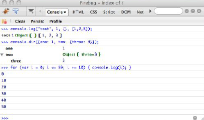

### Capítulo-1 
-------------------------------
## Introdução
<br>

O JavaScript é uma linguagem voltada para Web. Ele começou como uma maneira de manipular alguns tipos de elementos selecionados em páginas Web (como imagens e campos de formulário), mas cresceu tremendamente. Além de scripting browser do lado do cliente, agora você pode usar JavaScript para programar para um número crescente de plataformas. Você pode escrever código do lado do servidor (usando .Net ou Node.js), aplicativos para Desktop (que funcionam em todos os sistemas operacionais) e extensões de aplicativos (por exemplo, para Firefox ou Photoshop), aplicativos móveis e scripts de linha de comando.
JavaScript também é uma linguagem incomum. Ele não tem classes, e funções são Firstclass objetos usados para muitas tarefas. Inicialmente, a linguagem foi considerada deficiente por muitos desenvolvedores, mas atualmente essas opiniões mudaram. Curiosamente, linguagens como Java e php começaram a adicionar funcionalidades como encerramentos e funções anônimas, que os desenvolvedores JavaScript têm vindo a desfrutar e tomar para concedido por um tempo.
O JavaScript é dinâmico o suficiente para que você possa desenvolver como uma línguagem que você já é acostumado para desenvolvimento de suas aplicações. Mas a melhor abordagem é abraçar suas diferenças e estudar seus padrões específicos.

### Padrões (Patterns)

Um padrão (Patterns) no sentido mais amplo da palavra é um "conjunto de eventos recorrentes ou objetos... pode ser um template ou modelo que pode ser usado para gerar coisas"[http://en.wikipedia.org/wiki/Pattern](http://en.wikipedia.org/wiki/Pattern).
No desenvolvimento de software, um padrão é uma solução para um problema comum. Um padrão não é necessariamente uma solução de código pronta para copiar e colar, mas é uma prática recomendada, uma abstração útil e um modelo para resolver vários problemas.<br><br>

É importante identificar padrões porque: 
* eles nos ajudam a escrever um código melhor usando práticas comprovadas e não reinventar a roda.<br>
* Eles fornecem um nível de abstração-o cérebro pode conter apenas tanto em um determinado momento, por isso, quando você pensa sobre um problema mais complexo, ele ajuda se você não se preocupar com os detalhes de baixo nível, mas conta para eles com blocos de construção independentes (padrões).<br>
* Eles aprimoram a comunicação entre desenvolvedores e equipes, que geralmente estão em locais remotos e não se comunicam cara a cara. Basta colocar um rótulo em alguma técnica de codificação ou abordagem torna mais fácil ter certeza de que estamos falando sobre a mesma coisa. Por exemplo, é mais fácil dizer (e pensar) "função imediata", do que "esta coisa onde você embrulhar a função entre parênteses e no final dele colocar outro conjunto de parênteses para invocar a função direita onde você definiu-lo."<br>
Este livro discute os seguintes tipos de padrões:<br>
* Padrões de design<br>
* Padrões de codificação <br>
* Antipadrões<br>
Padrões de design (Design Patterns) são aqueles inicialmente definidos pelo livro "Gang of Four"(nomeado assim depois pelos seus quatro autores), originalmente publicado em 1994 distanciando o título Design Patterns: elementos de reutilizáveis Object-Oriented Software. Exemplos de padrões de design (Design Patterns) são singleton, fábricantes, decoradores, observadores, e assim por diante. Uma coisa sobre os padrões de design em relação ao JavaScript é que, embora independente da linguagem, os padrões de design foram principalmente estudados a partir da perspectiva de linguagens fortemente tipadas, como C++ e Java.
Às vezes, não faz necessariamente sentido aplicá-los textualmente em uma linguagem dinâmica digitada vagamente, como JavaScript. Às vezes, esses padrões são soluções alternativas que lidam com a natureza fortemente tipada das linguagens e a herança baseada em classe.
Em JavaScript, pode haver alternativas mais simples. Este livro discute implementações JavaScript de vários padrões de design (isso verá no capítulo 7).
Os padrões de codificação são muito mais interessantes; são padrões específicos de JavaScript e boas práticas relacionadas com as características únicas da linguagem, como os vários usos das funções. JavaScript codificação padrões são o principal tema do livro.
Você pode vir através de um antipadrão ocasional no livro. Antipadrões têm um pouco de som negativo ou mesmo insultuoso para o seu nome, mas que não precisa ser o caso. Um antipadrão não é o mesmo que um bug ou um erro de codificação; é apenas uma abordagem comum que causa mais problemas do que resolve-los. Os antipadrões são claramente marcados com um comentário no código.

### JavaScript: Conceitos
Vamos rapidamente passar por alguns conceitos importantes que irão fornecem um contexto para os seguintes capítulos.
#### Orientado a objetos
JavaScript é uma linguagem orientada a objetos, que muitas vezes surpreende os desenvolvedores. Qualquer coisa que você olha em um pedaço de código JavaScript tem uma boa chance de ser um objeto. Apenas cinco tipos primitivos não são objetos: Number, String, Boolean, NULL e undefined, os três primeiros têm representação de objeto correspondente na forma de invólucros primitivos (discutidos no próximo capítulo). Number, String e Boolean são valores primitivos facilmente convertidos em objetos pelo programador ou, por vezes, nos bastidores pelo interpretador JavaScript.<br>
Funções são objetos, também. Eles podem ter propriedades e métodos.<br>
A coisa mais simples que você faz em qualquer linguagem é definir uma variável. Bem, em JavaScript quando você define uma variável, você já está lidando com objetos. Primeiro, a variável automaticamente se torna uma propriedade de um objeto interno conhecido como um objeto de ativação (ou uma propriedade de objeto global se for uma variável global). Em segundo lugar, essa variável é, na verdade, também Object-like porque tem suas próprias propriedades (chamadas de atributos), que determinam se a variável pode ser alterada, excluída ou enumerada em um loop for-in. Esses atributos não são diretamente expostos no ECMAScript 3, mas a versão 5 oferece métodos de descrição especiais para manipulá-los.
Então, quais são os objetos? Porque eles fazem tantas coisas que devem ser muito especiais.
Na verdade, eles são extremamente simples. Um objeto é apenas uma coleção de propriedades nomeadas, uma lista de pares de chave-valor (quase idêntico a uma matriz associativa em outros idiomas).
Algumas das propriedades podem ser funções (objetos de função), caso em que os chamamos de métodos.
Outra coisa sobre os objetos que você cria é que você pode modificá-los a qualquer momento.
(embora ECMAScript 5 introduz APIs para evitar mutações.) Você pode pegar um objeto e adicionar, remover e atualizar seus membros. Se você está preocupado com a privacidade e acesso, vamos ver padrões para isso também.
E uma última coisa a ter em mente é que há dois tipos principais de objetos: nativo descrito no host padrão ECMAScript definido pelo ambiente de host (por exemplo, o ambiente do navegador) os objetos nativos podem ser categorizados como incorporados (for example, array, Date) ou definido pelo usuário (var o = {};).
Os objetos de host são, por exemplo, Window e todos os objetos DOM. Se você estiver se perguntando se você está usando objetos de host, tente executar seu código em um ambiente diferente, nonbrowser. Se ele funciona bem, você provavelmente está usando apenas objetos nativos.

### Sem uso de Classes

Você verá esta declaração repetida em várias ocasiões ao longo do livro: não há classes em JavaScript. Este é um conceito novo para programadores experientes e em outras línguagens é preciso mais do que algumas repetições e mais do que um pouco de esforço para "desaprender" as classes, e aceitar que o JavaScript lida com apenas objetos.
Não haver classes torna seus programas mais curtos — você não precisa ter uma classe para criar um objeto. Considere esta criação de objetos Java-like:
```js
//criação de objeto Java
HelloOO hello_oo = New HelloOO();
```
Repetindo a mesma coisa três vezes se parece com uma sobrecarga quando se trata de criar objetos simples. E mais frequentemente do que não, queremos manter nossos objetos simples.
Em JavaScript você cria um objeto em branco quando você precisa de um e, em seguida, começar a adicionar membros interessantes para ele. Você compõe objetos adicionando primitivos, funções ou outros objetos a eles como suas propriedades. Um objeto "em branco" não está totalmente em branco; vem com algumas propriedades internas já, mas não tem propriedades "próprias". Falaremos mais sobre isso no próximo capítulo.
Uma das regras gerais do Gang of Four diz: "prefira a composição do objeto à herança da classe." Isso significa que se você pode criar objetos de peças disponíveis que você tem em torno de mentir, esta é uma abordagem muito melhor do que criar cadeias de herança de long parent-child e classificações. Em JavaScript é fácil seguir este Conselho — simplesmente porque não há classes e composição de objetos, é o que você faz de qualquer maneira.

### Protótipos

JavaScript tem herança, embora está seja apenas uma maneira de reutilizar o código. (e há um capítulo inteiro sobre reutilização de código.) A herança pode ser realizada de várias maneiras, que geralmente fazem uso de protótipos. Um protótipo é um objeto (sem surpresas) e cada função que você criar automaticamente obtém uma propriedade prototype que aponta para um novo objeto em branco. Este objeto é quase idêntico a um objeto criado com um objeto literal ou Object() Construtor, exceto que sua propriedade de construtor aponta para a função que você irá criar e não para o built-in Object(). Você pode adicionar membros a este objeto em branco e posteriormente ter outros objetos herdando esse objeto e usar suas propriedades.
Discutiremos a herança em detalhes, mas por hora basta ter em mente que o protótipo é um objeto (não uma classe ou qualquer coisa especial) e cada função tem uma propriedade prototype.

#### O Ambiente

Os programas JavaScript precisam de um ambiente para ser executado. O habitat natural para um programa JavaScript é o browser, mas esse não é o único ambiente. Os padrões no livro são principalmente relacionados com o JavaScript Core (ECMAScript) para que eles são environmentagnostic.
Com exceções para: 
* Capítulo 8, que especificamente lida com padrões de navegador<br>
* alguns outros exemplos que ilustram aplicativos práticos de ambientes de padrão podem fornecer seus próprios objetos de host, que não são definidos no padrão ECMAScript e podem ter comportamento não especificado e inesperado.<br>

### ECMAScript5
o núcleo da linguagem JavaScript(excluindo DOM, BOM e extra host objects) é baseado no padrão ECMAScript. A versão 3 do padrão foi aceita oficialmente em 1999 e é aquela que atualmente é implementada em todos os navegadores.A versão 4 foi abandonada e a versão 5 foi aprovada em dezembro de 2009, 10 anos após o anterior.<br>
A versão 5 adiciona alguns novos objetos internos, métodos e propriedades para a linguagem, mas sua adição mais importante é o chamado modo estrito, que na verdade remove recursos da linguagem, tornando os programas mais simples e menos propensos a erros. Por exemplo, o uso da instrução with foi disparado ao longo dos anos. Agora em ES5 modo estrito que levanta um erro, embora seja aprovado se encontrado no modo não-estrito. O modo estrito é acionado por uma seqüência comum, que implementações mais antigas da linguagem simplesmente ignoram. Isso significa que o uso do modo estrito é compatível com versões anteriores, porque ele não gerará erros em navegadores antigos que não o compreendam.
Uma vez por escopo (escopo da função, escopo global ou no início de uma cadeia de caracteres passada para Eval ()), você pode usar a seguinte seqüência de caracteres: 
```js
function My(){
    "Uso estrito";
    //resto da função...
}
```
Isso significa que o código na função é executado no subconjunto estrito da linguagem. Para navegadores mais antigos esta é apenas uma seqüência não atribuída a qualquer variável, por isso não é usada, e ainda não é um erro.
O plano para a linguagem é que no futuro modo estrito será o único permitido.
Nesse sentido, ES5 é uma versão transitória — os desenvolvedores são incentivados, mas não obrigados, a escrever código que funciona em modo estrito.
O livro não explora padrões relacionados com ES5's adições específicas, porque no momento desta escrita não há navegador que implementa ES5. Mas os exemplos deste livro promovem uma transição para o novo padrão:
* garantir que as amostras de código oferecidas não levantarão erros em modo estrito <br>
* evitando e apontando construções preteridas, como argumentos. Calle <br>
* chamando os padrões ES3 que têm ES5 equivalentes internos, como Object. Create () <br>

### JSLint 
JavaScript é uma linguagem interpretada sem verificações de tempo de compilação estática. Assim, é possível implantar um programa quebrado com um erro de digitação simples, sem perceber. Aqui é onde JSLint ajuda.
JSLint [http://JSLint.com](http://JSLint.com) é uma ferramenta de qualidade de código JavaScript criada por Douglas Crockford que inspeciona seu código e avisa sobre problemas potenciais. É altamente recomendável que você executar o seu código através JSLint. A ferramenta "vai ferir seus sentimentos", como o seu criador adverte, mas apenas no início. Você pode rapidamente aprender com seus erros e adotar os hábitos essenciais de um programador JavaScript profissional. Não ter nenhum erro JSLint no seu código também ajuda você a estar mais confiante no código, sabendo que você não fez uma simples omissão ou erro de sintaxe em uma pressa.
Começando com o próximo capítulo, você verá JSLint mencionado muito. Todo o código no livro passa com sucesso na verificação do JSLint (com as configurações padrão, atual no momento de escrita), exceto por algumas ocasiões claramente marcada como antipadrões.
Em suas configurações padrão, JSLint espera que seu código seja estrito modo-compliant.

### O Console
O objeto console é usado em todo o livro. Este objeto não faz parte da linguagem, mas parte do ambiente e está presente na maioria dos navegadores atuais. No Firefox, por exemplo, ele vem com a extensão do Firebug. O console do Firebug tem uma interface do usuário que permite que você rapidamente digite e teste pequenos pedaços de código JavaScript e também brinque com a página atualmente carregada (consulte a Figura 1-1). Também é altamente recomendável como uma ferramenta de aprendizagem e exploratória. Funcionalidade semelhante está disponível em navegadores WebKit (Safari e Chrome) como parte do Inspetor Web e no IE começando com a versão 8 como parte de ferramentas de desenvolvedor.
A maioria dos exemplos de códigos neste livro usam o objeto console em vez de alert() ou atualizando a página atual, porque é uma maneira fácil e discreta de imprimir a saída.<br>
 
<br>
Muitas vezes usamos o método log(), que imprime todos os parâmetros que passados para ele e às vezes dir() que enumera o objeto passado para ele, e imprime todas as propriedades. Aqui está um exemplo de uso:
```js 
console.log("teste", 1, {}, [1, 2, 3]);
console.dir({um: 1, dois: {Three: 3}});
```
Quando você digita no console, você não precisa usar o console.log(); Você pode simplesmente omiti-lo. Para evitar a desordem, alguns trechos de código também podem ser ignorados, e suponhamos que você está testando o seguinte código no console:
```js 
 Window.Name === window['name']; //true 
``` 
 isso é como se tivéssemos usado o seguinte código: 
```js 
 console.log(Window.Name === window['name']);
``` 
e será imprimido true no console.

